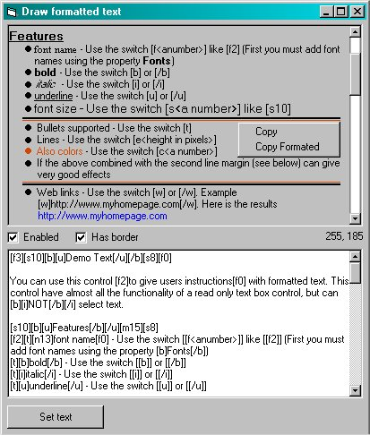



## Draw formated text \(update\)

### Description

Draw formatted text.

You can use this control to give users instructions with formatted text. This control have almost all the functionality of a read only text box control, but can NOT select text.

Features:

font name,

bold,

italic,

underline,

font size,

lines,

Bullets,

Colors,

Web links

Also, left margin for paragraphs.

Note: Also, you can set the margin for the second (and other) lines as well.
 
### More Info
 

             |
---                |---
**Submitted On**   |2003-03-17 11:54:30
**By**             |[UserXP](https://github.com/Planet-Source-Code/PSCIndex/blob/master/ByAuthor/userxp.md)
**Level**          |Intermediate
**User Rating**    |5.0 (15 globes from 3 users)
**Compatibility**  |VB 6\.0
**Category**       |[Custom Controls/ Forms/  Menus](https://github.com/Planet-Source-Code/PSCIndex/blob/master/ByCategory/custom-controls-forms-menus__1-4.md)
**World**          |[Visual Basic](https://github.com/Planet-Source-Code/PSCIndex/blob/master/ByWorld/visual-basic.md)
**Archive File**   |[Draw\_forma1565293282003\.zip](https://github.com/Planet-Source-Code/userxp-draw-formated-text-update__1-44083/archive/master.zip)

